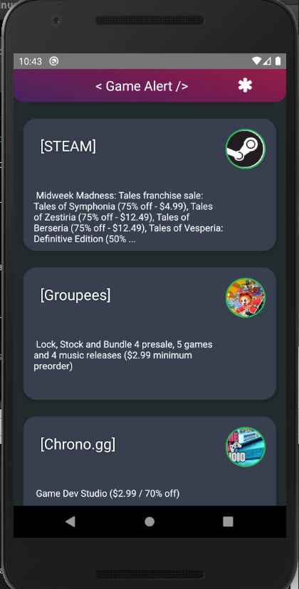
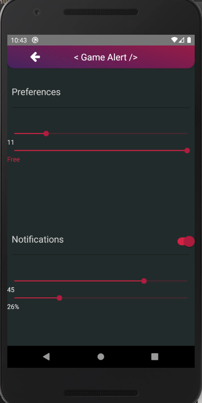

# GameAlert

GameAlert is a web - mobile app powered by the Reddit Api. The app will display game discounts and deals according to the user's preferences along with notifying the user for big price drops or free games. 




### Tech

GameAlert is build using:

* [React](https://reactjs.org/) - React is used for the web part.
* [React Native](https://facebook.github.io/react-native/) - Used for most of the app.
* [Android Studio](https://developer.android.com/studio) - Used alongside React Native.

GameAlert is open source with a [public repository](https://github.com/hectortav/reddit_notifications)
 on GitHub.

### Installation

GameAlert requires [Node.js](https://nodejs.org/) v4+ to run.
### Web App
Install the dependencies and devDependencies and start the server.

```sh
$ cd webapp
$ npm install
$ npm i create-react-app
$ npm start
```
### Android App
Install the dependencies and devDependencies and start the server.

Download [Android Studio](https://developer.android.com/studio)

```sh
$ cd androidapp
$ npm install
$ npm i react-native-cli
````
Follow the [React-Native Guide](https://facebook.github.io/react-native/docs/getting-started) for Android Studio
```sh
$ npm start
```

### Todos

 - Add Push Notifications
 - Add More Options
 - Better Optimization

License
----

MIT
